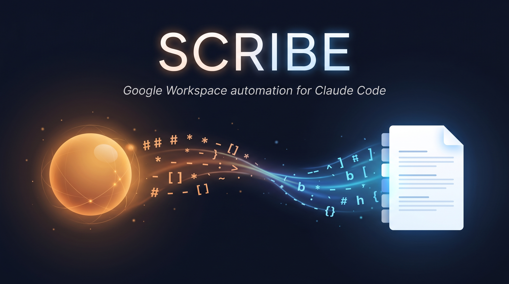
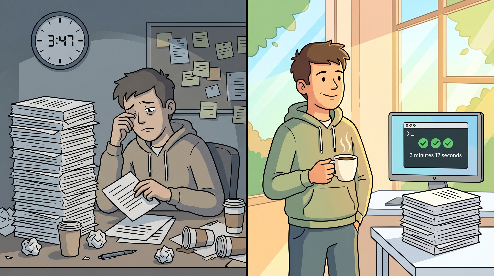
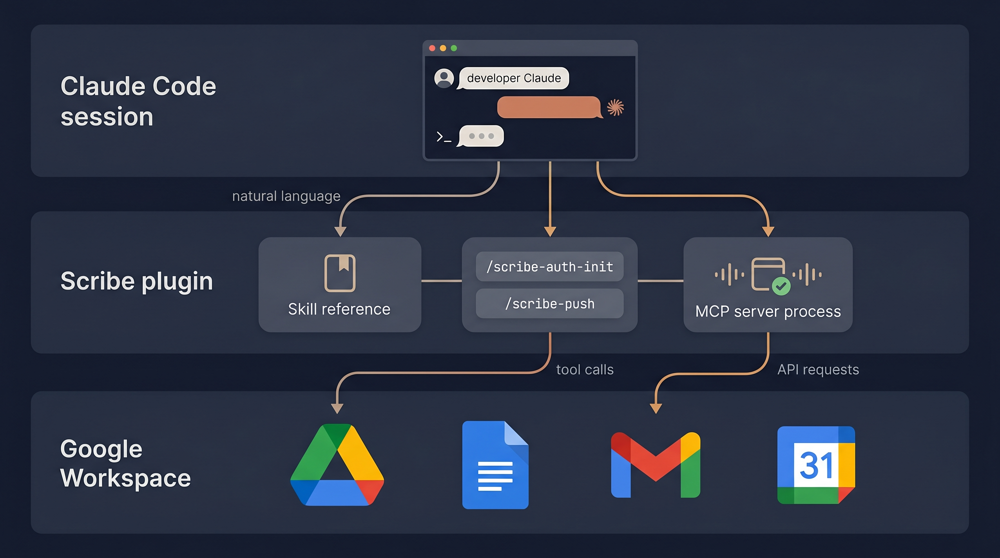

# Scribe

**Claude Code writes directly to your Google Docs. No more copy-paste dance.**



---

## The problem you keep solving the hard way

You live in Google Docs. Your client reviews happen there. Your team comments happen there. Your finished content ships from there.

But everything you write lives somewhere else first - in markdown, in your editor, in your Claude Code session. Getting it from "written" to "in the right Google Doc with the right formatting in the right tab" is grunt work that eats your production day -

- Copy the file

- Paste into Drive as markdown (hope the "convert" option is on today)

- Click into the right tab (or remember to make one)

- Compare against the source to catch missing sections

- Repeat 96 times for a full client push

Hours disappear into clipboard theatre. Client review slips a week because the docs aren't ready. You automate your markdown pipeline, your CI, your tests - but this one last mile stays stubbornly manual.



## The guide

Scribe is a Claude Code plugin that gives your Claude session direct API-level access to Google Workspace. Once installed, Claude can -

- Read any Google Doc (including tab structure and per-tab content)

- Write markdown into any Doc, tab by tab, with correct formatting preserved

- Create or update Drive folders and files

- Search Gmail threads and read Calendar events

It wraps [`workspace-mcp`](https://github.com/juliandickie/google_workspace_mcp/tree/fork-extension) - a fork of [taylorwilsdon's google_workspace_mcp](https://github.com/taylorwilsdon/google_workspace_mcp) extended with a high-fidelity markdown-to-Google-Docs writer.

## How it works



Three layers, one install -

1. **Your Claude Code session** issues a natural-language request ("update the Blog Article tab in the D01 doc with the latest markdown")

2. **Scribe** matches the request to the right skill and routes the call to its MCP server

3. **The MCP server** handles OAuth, calls Google's Drive + Docs + Gmail + Calendar APIs, and returns the result

You never touch a browser tab. The markdown-to-Google-Doc conversion happens server-side with full fidelity - headings, bold and italic, lists, code blocks, blockquotes, links, all preserved. And because it is Claude writing the commands, you can speak to it naturally - no memorised CLI flags.

## The plan - three commands to a working install

```bash
# 1. Add this plugin's marketplace
/plugin marketplace add juliandickie/scribe-plugin

# 2. Install Scribe
/plugin install scribe

# 3. Guided OAuth setup
/scribe:auth-init
```

First MCP invocation takes a few seconds while `uvx` downloads the server from the fork. Every subsequent call is instant.

## Google Cloud setup - 5 minutes, one time

Before Scribe can talk to Google, you need your own OAuth client credentials. No shared client IDs - you own your quota, your consent screen, your trust boundary.

1. Visit [console.cloud.google.com](https://console.cloud.google.com) and sign in with your Google account

2. Create a new project (suggest the name `scribe-personal`)

3. Under **APIs & Services > Library**, enable -

    - **Google Drive API** (mandatory)

    - **Google Docs API** (mandatory)

    - **Gmail API** (optional, for mail operations)

    - **Google Calendar API** (optional, for calendar reads)

4. Under **APIs & Services > OAuth consent screen**, configure a minimal consent screen

    - User type - External

    - App name - anything (e.g., "Scribe personal")

    - Support and developer email - your own

5. Under **APIs & Services > Credentials**, click **Create Credentials > OAuth client ID**

    - Application type - **Desktop app**

    - Name - "Scribe desktop client"

6. Download the JSON. Save to `~/.workspace-mcp/oauth_client.json`.

7. Run `/scribe:auth-init` in Claude Code and follow the prompts.

Your credentials never leave your machine. Tokens are stored encrypted at `~/.workspace-mcp/`.

## Slash command reference

| Command | What it does |
|---|---|
| `/scribe:auth-init` | Guided first-run Google Cloud and OAuth setup |
| `/scribe:auth-add` | Authenticate an additional Google account |
| `/scribe:auth-status` | List authenticated accounts and token validity |
| `/scribe:push` | Push a markdown file to Drive as a new or updated Doc |
| `/scribe:client-resolve` | Resolve a CLIENT-ID (AHPRA-style repos) to account and folder |

## File-path sandbox - read this before your first push

The MCP server enforces a directory sandbox via `ALLOWED_FILE_DIRS`. The plugin's manifest defaults this to `~/.workspace-mcp/attachments`. **Files outside that directory cannot be uploaded via `import_to_google_doc`.**

Two ways to handle this -

- **Per-session copy** (simple). For ad-hoc pushes, copy the source file into `~/.workspace-mcp/attachments/scribe-session/` first. The `/scribe:push` skill walks Claude through this automatically.

- **Persistent override** (for projects with stable source directories). Set `ALLOWED_FILE_DIRS` in `~/.claude/settings.json` to additionally include your project root -

   ```json
   "mcpServers": {
     "scribe": {
       "env": {
         "ALLOWED_FILE_DIRS": "${HOME}/.workspace-mcp/attachments:${HOME}/code/my-project"
       }
     }
   }
   ```

   Multiple paths colon-separated on macOS/Linux, semicolon-separated on Windows.

**Important** - symlinks do NOT bypass the sandbox. The server resolves symlinks via `realpath()` before the check. Either copy the file or extend `ALLOWED_FILE_DIRS`.

## Multi-account support

Scribe handles multiple authenticated accounts concurrently when they all sit inside the SAME Google Workspace organisation (or all use personal Gmail). Pass `user_google_email` as a parameter to any MCP tool call, set `USER_GOOGLE_EMAIL` in your shell session, or store it in a project's config file.

### Multi-org / cross-Workspace setup (different story)

If you have accounts across **separate Google Workspace organisations** (e.g. one for your agency, one for an institute or client engagement), the OAuth client model gets in the way. Each org's Internal-type OAuth client only accepts identities from the OWNING Workspace, so you need ONE OAuth client per org.

The plugin supports this via a symlink-swap pattern. See [docs/multi-org-setup.md](docs/multi-org-setup.md) for the step-by-step setup, including a ready-to-use `switch.sh` helper. Summary -

1. Create a separate Google Cloud project + OAuth client inside EACH Workspace org

2. Save each `client_secret_*.json` to `~/.workspace-mcp/`

3. Symlink the active one to `~/.workspace-mcp/oauth_client.json`

4. Use `switch.sh <org>` to flip the symlink when changing context

Token caches are per-account, so authenticating once per org means you can push to either org's Drive without re-consenting.

## Troubleshooting

**"OAuth client credentials not found" (during auth flow)** - your `oauth_client.json` is not at `~/.workspace-mcp/oauth_client.json`. Run `/scribe:auth-init` to set it up correctly. Don't trust the error message's path suggestion (it points at a uv cache directory that gets blown away on plugin updates).

**"No cached token"** - run `/scribe:auth-init` (if first install) or `/scribe:auth-add EMAIL` (if you've authenticated some accounts but not the one this call needs).

**"Invalid grant" or "unauthorized"** - OAuth consent may have been revoked at [myaccount.google.com](https://myaccount.google.com/permissions). Re-run `/scribe:auth-init` to re-consent.

**Token expired** - the MCP server auto-refreshes on next call. If refresh fails (rare), re-authenticate via `/scribe:auth-init`.

**API quota exceeded** - Google's default quota is 60 requests per minute per user. Heavy batch operations may need you to request a quota increase on your Cloud Console.

**First install is slow** - the `mcpServers` declaration in `plugin.json` uses `uvx` to pull the server from GitHub on first invocation. Subsequent calls use the cached install and are near-instant.

**Want to pre-install instead of waiting for first use** - an optional convenience script is at `hooks/post-install.sh` in the plugin's install directory. Run it manually to eagerly pip-install the server.

**"Path is outside permitted directories" when pushing a file** - your source file is outside the sandbox. See "File-path sandbox" section above. Symlinks don't bypass it.

**`HttpError 500` from Drive on a single file in a batch** - Google's Drive upload endpoint occasionally returns a transient 500. Re-run the failed file - the second attempt almost always succeeds. Auto-retry is on the upstream fork's roadmap.

**Slash command not found** - the auth skills (`/scribe:auth-init`, `/scribe:auth-add`, `/scribe:auth-status`, `/scribe:client-resolve`) are user-invokable only - they have `disable-model-invocation: true` in their frontmatter so Claude won't auto-trigger them. Type the slash command yourself; if it doesn't appear, run `/plugin install scribe` to confirm the plugin is loaded.

## What Scribe enables

Real examples from production use of the underlying fork -

- **Agency batch content push** - one agency populates 12 condition documents × 8 content tabs each (96 tabs) for a clinic client in under 4 minutes, end-to-end. The equivalent browser-paste workflow used to take close to an hour.

- **In-session edits** - "update the second paragraph of the Pricing page to reflect the new numbers" works as a one-shot in Claude Code. No context switch to a browser.

- **Read-and-reason** - "summarise the client comments on the Services doc and group them by theme" turns a tedious review into a one-request answer.

## Source

Scribe wraps [taylorwilsdon/google_workspace_mcp](https://github.com/taylorwilsdon/google_workspace_mcp), pulled via uvx from a tracked fork branch. The markdown-writer capability that powers `manage_doc_tab populate_from_markdown` was contributed via [PR #727](https://github.com/taylorwilsdon/google_workspace_mcp/pull/727) (merged 2026-04-26) - merged with a bonus refactor by Taylor that consolidated four tab tools into the single action-based `manage_doc_tab` you see today.

Issues, PRs, and feature requests for the underlying MCP server to [taylorwilsdon's repo](https://github.com/taylorwilsdon/google_workspace_mcp). Issues specific to this plugin (skills, slash commands, install flow) to [this repo](https://github.com/juliandickie/scribe-plugin).

## License

MIT. See [LICENSE](LICENSE).

---

Built by [Julian Dickie](https://github.com/juliandickie) for agencies that ship content faster than their tooling should allow.
