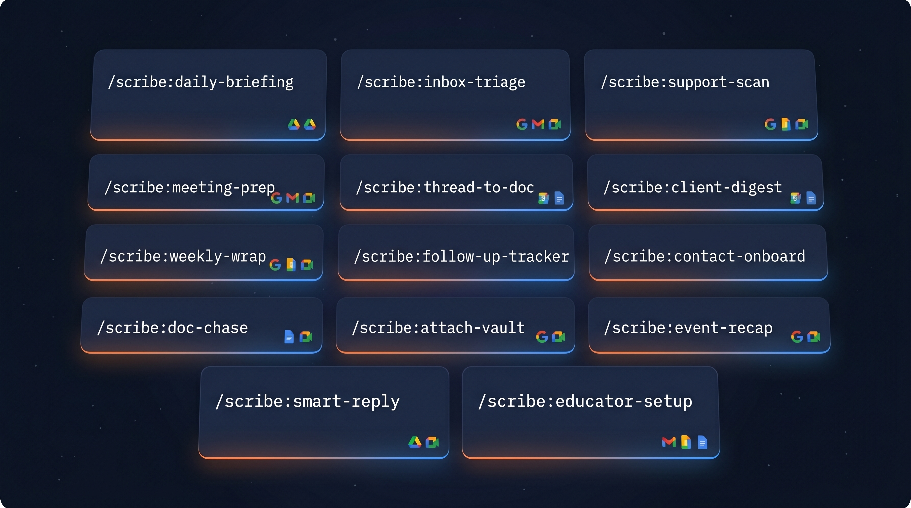
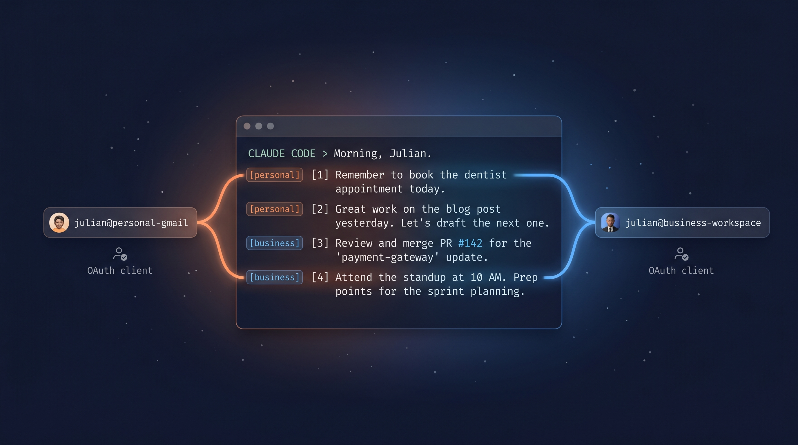
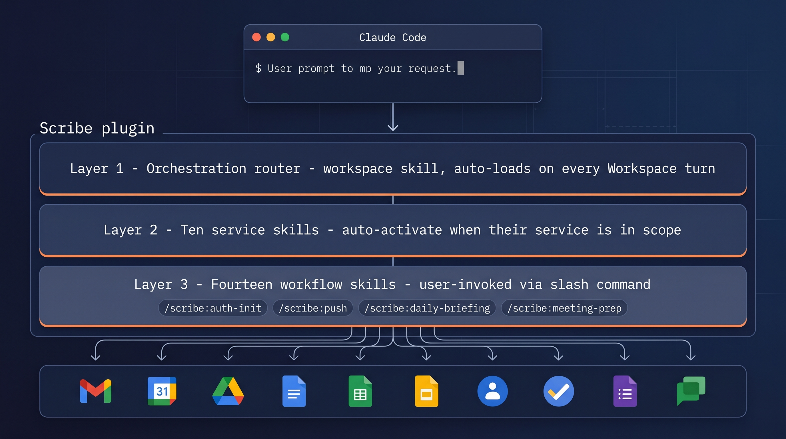

# Scribe

**Google Workspace orchestration for Claude Code. Stop stitching your day together by hand.**


---

**Version 1.1.0** | MIT licensed | Wraps [taylorwilsdon/google_workspace_mcp](https://github.com/taylorwilsdon/google_workspace_mcp)

```bash
/plugin marketplace add juliandickie/scribe-plugin
/plugin install scribe
/scribe:auth-init
```

---

## Your day in Google Workspace shouldn't look like this


You run on Google Workspace. Gmail, Calendar, Drive, Docs, Sheets, Slides, Contacts, Tasks, Forms, Chat. Probably across two accounts (personal and business, or agency and client). Most of your day is the seams between them.

Search the inbox. Copy the address into a calendar event. Pull the attachments into a Drive folder. Open the Sheet to log the lead. Draft the Doc with the meeting notes. Send the follow-up. Repeat tomorrow.

You bought an AI assistant. It can write paragraphs about how it would help, but it cannot actually touch any of this work. Every "let me help you" ends at the chat window.

That is the gap Scribe closes.

## Scribe is the layer that's been missing

Scribe is a Claude Code plugin that gives Claude real, scoped, multi-account access to every service in your Google Workspace and the named workflows for what you actually do with them.

Not "AI summaries of your emails." Scribe drafts the reply, labels the thread, logs the lead to the tracking sheet, books the follow-up on the calendar, and saves the attachment to the right Drive folder. In one prompt. Across both your accounts if you want.

It is built on Taylor Wilsdon's excellent [`workspace-mcp`](https://github.com/taylorwilsdon/google_workspace_mcp) and adds the orchestration layer - the routing, the multi-account handling, the fourteen named workflows, and the one-command install - that turns a raw MCP into an everyday operating system.

## Three steps to working AI on your Workspace

```bash
# 1. Add the marketplace and install
/plugin marketplace add juliandickie/scribe-plugin
/plugin install scribe

# 2. One-time OAuth setup (about 5 minutes per Workspace org)
/scribe:auth-init

# 3. Speak. Or invoke a named workflow.
/scribe:daily-briefing
```

That is it. You are now talking to your Workspace.

## Fourteen workflows that already know the pattern



Named slash commands for the cross-service patterns you would otherwise hand-stitch every time. Each one accepts natural-language invocation or explicit flags.

- `/scribe:daily-briefing` - morning sweep of inbox plus calendar across every account you've authenticated.

- `/scribe:inbox-triage` - categorise unread, apply labels, draft replies in batch across inboxes.

- `/scribe:support-scan` - scan a support inbox, log each ticket to the tracking sheet, draft responses.

- `/scribe:meeting-prep` - pull a meeting plus the related thread history into a structured prep doc.

- `/scribe:thread-to-doc` - convert an email thread into a Doc with attachments saved to the client folder.

- `/scribe:client-digest` - aggregate emails plus calendar plus Drive activity for a single contact or company.

- `/scribe:weekly-wrap` - compile a week of activity across services into a summary doc.

- `/scribe:follow-up-tracker` - find sent emails with no reply, draft the nudge.

- `/scribe:contact-onboard` - bootstrap a Drive folder plus a Contact plus a Sheet row plus a welcome email in one move.

- `/scribe:doc-chase` - find shared docs with no review activity, ping the reviewers.

- `/scribe:attach-vault` - organise email attachments into Drive by sender or by project.

- `/scribe:event-recap` - post-meeting notes doc plus follow-up email draft, generated together.

- `/scribe:smart-reply` - draft a contextual reply using the prior history with that contact.

- `/scribe:educator-setup` - bootstrap an educator's Drive folder structure and welcome.

Full reference - [docs/workflows.md](docs/workflows.md).

## Ten services. One conversation. Every account.



Scribe covers the full Workspace surface, not just the bits that are easy.

| Service | What Claude can do |
| --- | --- |
| Gmail | Search, read, draft, send, label, batch-modify, attachments |
| Calendar | Events, free or busy, focus time, out of office, multi-calendar |
| Docs | Tabs, batch updates, find and replace, structured insertion |
| Drive | Folders, files, sharing, permissions, public access checks |
| Sheets | Ranges, formulas, append rows, table creation, conditional formatting |
| Slides | Read decks, create presentations, update slide content |
| Contacts | Look up by name or email, create contacts, manage groups |
| Tasks | Google Tasks lists and items, complete, manage |
| Forms | Read responses, create forms, list submissions |
| Chat | Send and read Google Chat messages |

And it handles multiple authenticated accounts in a single Claude session. Personal Gmail and business Workspace. Agency org and own org. Each call routes to the right identity, automatically or by your direction.

```text
You    "Check both my inboxes for anything urgent today and draft replies."
Scribe (queries julian@personal-gmail and julian@business-workspace in parallel)
       (drafts replies in each account, labels the originals,
        surfaces a single ranked summary back to you)
```

Service reference - [docs/services.md](docs/services.md). Multi-org setup - [docs/multi-org-setup.md](docs/multi-org-setup.md).

## What changes by tomorrow morning


You make coffee. By the time you sit down, `/scribe:daily-briefing` has already done the rounds. You read one screen instead of opening ten tabs.

The support inbox is logged into the tracking Sheet without you touching it. The contract follow-ups went out yesterday. The meeting prep doc for ten is already in the right Drive folder, with the prior thread history pulled in and the agenda drafted.

You spend your morning on the work that actually needs you. Not the seams.

## Built on solid ground



Scribe is thirty-one skills organised in a three-layer architecture.

1. **Orchestration router** - one skill that auto-loads on every Workspace request and routes between accounts, services, and workflows.

2. **Service skills** - ten skills, one per Google service, each auto-activating when their service is in scope. They teach Claude the full MCP tool API for that surface.

3. **Workflow skills** - fourteen user-invoked skills (the `/scribe:` commands above), each a complete recipe for one cross-service pattern.

Each skill stays under 500 lines, so Claude reads only what it needs. The underlying MCP server is taylorwilsdon's [`workspace-mcp`](https://github.com/taylorwilsdon/google_workspace_mcp), pinned to a known-good version (`workspace-mcp@1.26.1`) and pulled automatically by uvx on install.

## Setup, multi-org, customisation

The first-run flow walks through Google Cloud Project setup and OAuth (5 to 10 minutes once per Workspace org).

```bash
/scribe:start            # see what Scribe can do and which accounts are authenticated
/scribe:auth-init        # one-time per org
/scribe:auth-add EMAIL   # add another account to the token cache
/scribe:auth-status      # list authenticated accounts
```

Two Workspace orgs that don't share an OAuth consent screen? See [docs/multi-org-setup.md](docs/multi-org-setup.md) for the symlink-swap pattern that lets one Claude session reach both.

Want to tighten the OAuth scopes per service? `--permissions SERVICE:LEVEL` lives in `skills/auth-init/SKILL.md` under "Restricting scopes (advanced)."

Want to fork a workflow to your shape? Every workflow is an independent file under `skills/`. Edit any of them. Nothing else breaks.

## License

MIT. Use it, modify it, ship it.

## Credits

Scribe is the orchestration layer. The capability underneath is [`workspace-mcp`](https://github.com/taylorwilsdon/google_workspace_mcp) by [@taylorwilsdon](https://github.com/taylorwilsdon). The breadth of v1.0 is only possible because of his work. If you want the raw MCP without the orchestration, install it directly from PyPI; if you want the workflows, the multi-account routing, and the one-command setup, install Scribe.
